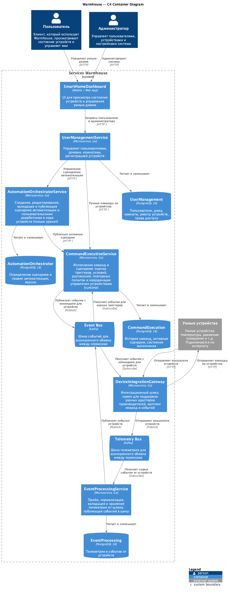
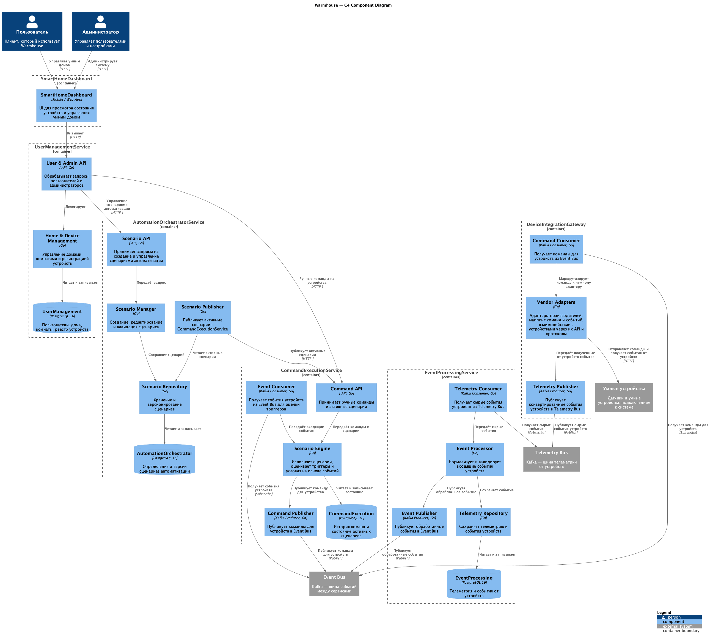
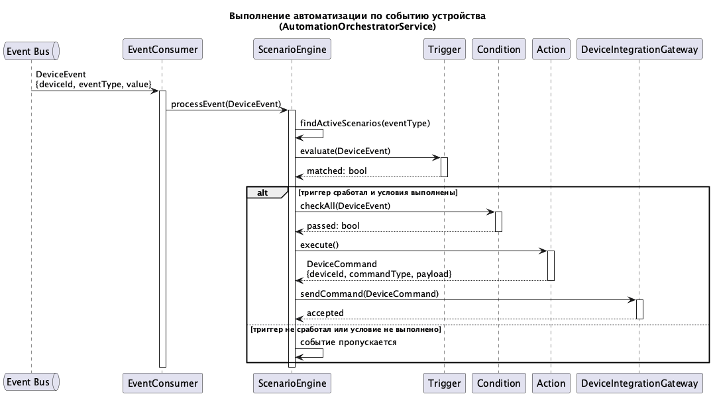
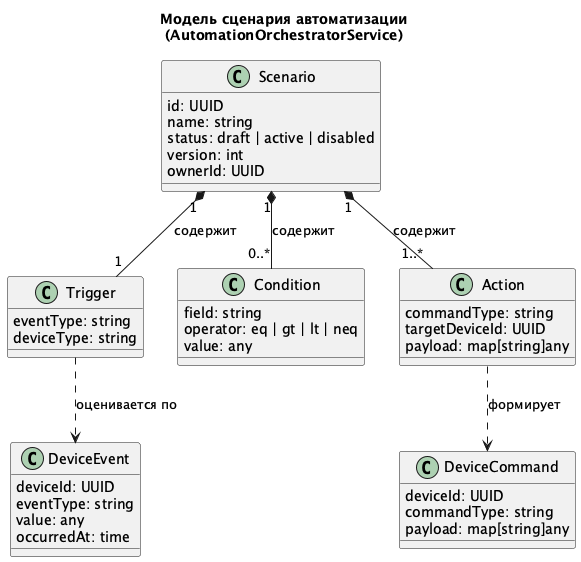
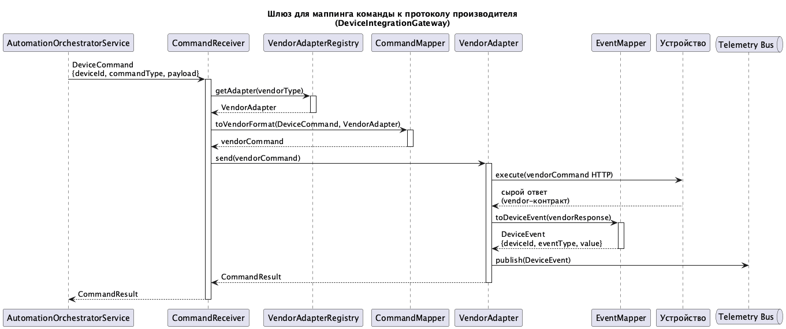
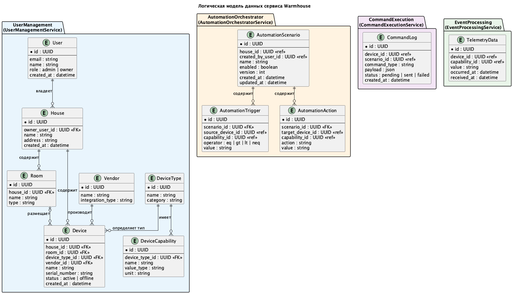

# Warmhouse — умный дом

Проект описывает пошаговые изменения системы управления умным домом от монолитной архитектуры к микросервисной.


# Задание 1. Анализ и планирование

### 1. Описание функциональности монолитного приложения

**Управление устройствами:**

- Пользователи могут просматривать список подключённых датчиков и их текущее состояние.
- Администраторы могут добавлять, обновлять и удалять датчики через REST API.
- Система поддерживает хранение метаданных датчика: имя, тип, расположение, единица измерения.

**Мониторинг температуры:**

- Пользователи могут видеть актуальные показания температуры по комнатам и по идентификатору датчика.
- Система получает показания в реальном времени, проксируя запросы к внешнему Temperature API.
- Датчики сообщают своё текущее значение и статус через HTTP PATCH-запросы к монолиту.

### 2. Анализ архитектуры монолитного приложения

Приложение написано на Go (v1.22) и реализовано как единый процесс с одной базой данных PostgreSQL 16.

- **HTTP-фреймворк:** Gin — маршрутизация всех входящих запросов внутри одного бинарника.
- **База данных:** PostgreSQL — единое хранилище для всех сущностей (датчики, статусы, метаданные).
- **Внешняя интеграция:** Temperature API (отдельный сервис на порту 8081) — монолит обращается к нему по HTTP для получения актуальных показаний.
- **Взаимодействие компонентов:** все слои (маршрутизация, бизнес-логика, доступ к данным) находятся в одном процессе и обращаются к общей БД напрямую. Никакой асинхронной обработки нет.
- **Деплой:** Docker-контейнер, запускается через docker-compose вместе с PostgreSQL и Temperature API.

### 3. Определение доменов и границ контекстов

| Домен | Ответственность |
|---|---|
| **Пользователи и устройства** | Управление учётными записями, домами, комнатами, регистрация устройств, права доступа |
| **Управление сценариями** | Создание, хранение и публикация сценариев поведения устройств |
| **Исполнение команд** | Обработка входящих событий, оценка триггеров и условий, отправка команд устройствам |
| **Телеметрия и события** | Приём, нормализация, валидация и хранение показаний от устройств |
| **Интеграция с устройствами** | Связь с устройствами через API, путем подготовки запросов под разные контракты от производителей (препдпологается, что его можно будет расширять новыми контрактами для поддержки новых вендрово) |

### 4. Проблемы монолитного решения

- **Невозможность независимого масштабирования.** При росте нагрузки на один компонент (например, на приём телеметрии) приходится масштабировать весь монолит целиком.
- **Жёсткая связанность.** Добавление нового типа устройства или протокола требует изменений во всём приложении и полного передеплоя.
- **Отсутствие асинхронной обработки.** Все взаимодействия синхронные. Пиковая нагрузка от устройств напрямую влияет на время ответа пользователям.
- **Единственная точка отказа.** Сбой любого компонента (БД, Temperature API, HTTP-слой) роняет всю систему.
- **Ограниченная наблюдаемость.** Без разделения на сервисы сложно отслеживать и изолировать проблемы в отдельных доменах.

### 5. Визуализация контекста системы — диаграмма C4

Диаграмма контекста монолита (C4 Context):

[schemas/context/monolith_diagram.puml](schemas/context/monolith_diagram.puml)

Диаграмма показывает трёх внешних участников: **Пользователь** (просмотр данных), **Администратор** (управление конфигурацией) и **Умные устройства** (отправка телеметрии). Монолит выступает единственной системой, взаимодействующей с внешним Temperature API.


# Задание 2. Проектирование микросервисной архитектуры

Новая архитектура разбивает монолит на специализированные сервисы с чёткими зонами ответственности. Сервисы взаимодействуют через REST API и две Kafka-шины: **Event Bus** (команды и события между сервисами) и **Telemetry Bus** (телеметрия от устройств). Каждый сервис владеет собственной базой данных.

> ACL, аутентификация и авторизация в данных схемах не отражены — акцент сделан на декомпозиции и взаимодействии микросервисов.

**Сервисы целевой архитектуры:**

- `SmartHomeDashboard` — веб- и мобильный UI, единая точка входа для пользователей и администраторов.
- `UserManagementService` — управление пользователями, домами, комнатами и регистрацией устройств.
- `AutomationOrchestratorService` — создание, редактирование, валидация и публикация сценариев автоматизации.
- `CommandExecutionService` — исполнение команд и сценариев в реальном времени: оценка триггеров, условий, расписаний, повторных попыток (runtime).
- `EventProcessingService` — приём, нормализация, валидация и хранение телеметрии; публикация событий в Event Bus.
- `DeviceIntegrationGateway` — шлюз интеграции с устройствами разных производителей; скрывает вендорные протоколы и API от остальных сервисов.

**Диаграмма контейнеров (Containers)**

Исходник PlantUML: [`schemas/container/microsevice_diagram_container.puml`](schemas/container/microsevice_diagram_container.puml).



**Диаграмма компонентов (Components)**

Исходник PlantUML: [`schemas/component/microsevice_diagram_component.puml`](schemas/component/microsevice_diagram_component.puml).



Диаграмма раскрывает внутреннюю структуру каждого сервиса: API-компоненты, бизнес-логику, Kafka-продьюсеры и консьюмеры, репозитории и вендорные адаптеры внутри `DeviceIntegrationGateway`.

**Диаграмма кода (Code)**

Последовательность выполнения автоматизации в `AutomationOrchestratorService`: от получения `DeviceEvent` до отправки `DeviceCommand` в шлюз. Исходник: [`schemas/code/automation_execution_sequence.puml`](schemas/code/automation_execution_sequence.puml).



Доменная модель: `Scenario`, `Trigger`, `Condition`, `Action`, `DeviceEvent`, `DeviceCommand`. Исходник: [`schemas/code/scenario_model_class.puml`](schemas/code/scenario_model_class.puml).



Маппинг команды к контракту производителя внутри `DeviceIntegrationGateway`. Исходник: [`schemas/code/vendor_command_mapping_sequence.puml`](schemas/code/vendor_command_mapping_sequence.puml).



### Основные сценарии взаимодействия

**Ручное управление устройством:**
1. Пользователь отправляет команду через `SmartHomeDashboard`.
2. `UserManagementService` передаёт команду в `CommandExecutionService`.
3. `CommandExecutionService` публикует команду в `Event Bus`.
4. `DeviceIntegrationGateway` получает команду из `Event Bus` и доставляет её на устройство через API производителя.

**Создание сценария автоматизации:**
1. Пользователь создаёт сценарий через `SmartHomeDashboard` → `UserManagementService` → `AutomationOrchestratorService`.
2. `AutomationOrchestratorService` валидирует, версионирует и публикует активный сценарий в `CommandExecutionService`.
3. `CommandExecutionService` ожидает событий для запуска триггеров.

**Обработка телеметрии и запуск автоматизации:**
1. Устройство отправляет событие → `DeviceIntegrationGateway` публикует его в `Telemetry Bus`.
2. `EventProcessingService` нормализует, сохраняет и публикует событие в `Event Bus`.
3. `CommandExecutionService` оценивает триггеры активных сценариев и при выполнении условий публикует команду в `Event Bus`.
4. `DeviceIntegrationGateway` доставляет команду на нужное устройство.


# Задание 3. Разработка ER-диаграммы

Модель данных умного дома (исходник PlantUML: [`schemas/erd/smart_home_erd.puml`](schemas/erd/smart_home_erd.puml)):



# Задание 4. Создание и документирование API

### 1. Тип API

Для синхронных взаимодействий между сервисами (создание сценариев, отправка команд, доставка команды на устройство) используется **REST/HTTP** и документируется через **OpenAPI 3.1**. Эти операции инициируются пользователем или другим сервисом и требуют немедленного подтверждения (201 Created, 202 Accepted).

Для асинхронных событий (телеметрия устройств, статус команды) используется **Kafka** и документируется через **AsyncAPI 2.6**. Telemetry Bus и Event Bus — это однонаправленные потоки данных с неизвестными на момент публикации консьюмерами, что делает REST неуместным: сервис-источник не должен знать о получателях.

### 2. Документация API

Спецификации находятся в директории [`schemas/api/`](schemas/api/):

**OpenAPI** описывает 4 эндпоинта:
- `POST /api/v1/scenarios` — создание сценария автоматизации (`AutomationOrchestratorService`)
- `POST /api/v1/scenarios/{scenarioId}/publish` — публикация сценария в runtime (`AutomationOrchestratorService` → `CommandExecutionService`)
- `POST /api/v1/commands` — приём ручной команды от пользователя (`CommandExecutionService`)
- `POST /api/v1/device-commands` — доставка нормализованной команды на устройство (`DeviceIntegrationGateway`)

**AsyncAPI** описывает 2 канала:
- `device.telemetry.received` — Telemetry Bus: `DeviceIntegrationGateway` публикует нормализованную телеметрию, `EventProcessingService` потребляет
- `automation.command.status.changed` — Event Bus: `CommandExecutionService` публикует статус команды, `SmartHomeDashboard` потребляет

# Задание 5. Работа с docker и docker-compose

Перейдите в apps.

Там находится приложение-монолит для работы с датчиками температуры. В README.md описано как запустить решение.

Вам нужно:

1) сделать простое приложение temperature-api на любом удобном для вас языке программирования, которое при запросе /temperature?location= будет отдавать рандомное значение температуры.

Locations - название комнаты, sensorId - идентификатор названия комнаты

```
	// If no location is provided, use a default based on sensor ID
	if location == "" {
		switch sensorID {
		case "1":
			location = "Living Room"
		case "2":
			location = "Bedroom"
		case "3":
			location = "Kitchen"
		default:
			location = "Unknown"
		}
	}

	// If no sensor ID is provided, generate one based on location
	if sensorID == "" {
		switch location {
		case "Living Room":
			sensorID = "1"
		case "Bedroom":
			sensorID = "2"
		case "Kitchen":
			sensorID = "3"
		default:
			sensorID = "0"
		}
	}
```

2) Приложение следует упаковать в Docker и добавить в docker-compose. Порт по умолчанию должен быть 8081

3) Кроме того для smart_home приложения требуется база данных - добавьте в docker-compose файл настройки для запуска postgres с указанием скрипта инициализации ./smart_home/init.sql

Для проверки можно использовать Postman коллекцию smarthome-api.postman_collection.json и вызвать:

- Create Sensor
- Get All Sensors

Должно при каждом вызове отображаться разное значение температуры

Ревьюер будет проверять точно так же.

### Решение

**Что реализовано:**

- `apps/temperature-api/` — простой Go-сервис (stdlib `net/http`, без зависимостей).
- `GET /temperature?location=kitchen` — возвращает случайную температуру от −10 до 35 °C.
- `GET /temperature/{sensorId}` — то же самое по ID сенсора (используется `smart_home` для обогащения данных датчиков).
- `GET /health` — возвращает `{"status": "ok"}`.
- PostgreSQL 16 инициализируется скриптом `./smart_home/init.sql`.

**Запуск:**

```bash
cd apps
docker-compose up --build
```

Сервисы после старта:
- `smart_home` API: `http://localhost:8080`
- `temperature-api`: `http://localhost:8081`
- PostgreSQL: `localhost:5432`

**Пример запроса к temperature-api:**

```
GET http://localhost:8081/temperature?location=kitchen
```

```json
{"value": 23.7, "unit": "celsius", "location": "kitchen", "status": "active", ...}
```

**Проверка через Postman:** импортировать `apps/smarthome-api.postman_collection.json`, вызвать `Create Sensor`, затем `Get All Sensors` — при каждом вызове значение температуры будет разным.


# **Задание 6. Разработка MVP**

Необходимо создать новые микросервисы и обеспечить их интеграции с существующим монолитом для плавного перехода к микросервисной архитектуре. 

### **Что нужно сделать**

1. Создайте новые микросервисы для управления телеметрией и устройствами (с простейшей логикой), которые будут интегрированы с существующим монолитным приложением. Каждый микросервис на своем ООП языке.
2. Обеспечьте взаимодействие между микросервисами и монолитом (при желании с помощью брокера сообщений), чтобы постепенно перенести функциональность из монолита в микросервисы. 

В результате у вас должны быть созданы Dockerfiles и docker-compose для запуска микросервисов.

### Решение

**Что реализовано:**

Два новых Go-микросервиса с in-memory хранилищем (MVP, без БД):

| Сервис | Порт | Назначение |
|--------|------|------------|
| `device-service` | 8082 | Реестр устройств: создание, получение, обновление статуса |
| `telemetry-service` | 8083 | Приём и хранение телеметрии устройств |

**Интеграция с монолитом:**

Монолит получает переменные окружения в docker-compose:
- `DEVICE_SERVICE_URL=http://device-service:8082`
- `TELEMETRY_SERVICE_URL=http://telemetry-service:8083`

Сервисы доступны в одной Docker-сети `smarthome-network`. Монолит может вызывать их по HTTP-имени контейнера.

**Запуск:**

```bash
cd apps
docker-compose up --build
```

**Проверка health:**

```bash
curl http://localhost:8082/health
curl http://localhost:8083/health
```

**device-service — примеры запросов:**

```bash
# Создать устройство
curl -X POST http://localhost:8082/devices \
  -H "Content-Type: application/json" \
  -d '{"houseId":"house-1","roomId":"room-1","name":"Kitchen sensor","type":"temperature_sensor","vendor":"demo"}'

# Получить список устройств
curl http://localhost:8082/devices

# Получить устройство по ID
curl http://localhost:8082/devices/{id}

# Обновить статус
curl -X PATCH http://localhost:8082/devices/{id}/status \
  -H "Content-Type: application/json" \
  -d '{"status":"offline"}'
```

**telemetry-service — примеры запросов:**

```bash
# Отправить событие телеметрии
curl -X POST http://localhost:8083/telemetry \
  -H "Content-Type: application/json" \
  -d '{"deviceId":"device-1","capability":"temperature","value":24.6,"unit":"celsius","occurredAt":"2026-05-04T10:00:00Z"}'

# Получить всю телеметрию
curl http://localhost:8083/telemetry

# Получить телеметрию по устройству
curl http://localhost:8083/telemetry/device/device-1
```